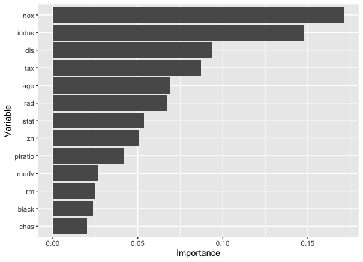

# ParallelBayesOptQRF
ParallelBayesOptQRF is an R package that allows to optimize Quantile Regression Forests models via parallel Bayesian Optimization. This package allows also to compute multiple non-crossing quantiles and it is built upon the R packages parBayesianOptimization, ranger, grf and randomForestSRC.

It is possibile to specify the type of Quantile Regression Forest to be fitted, the score function, define the search space, and set optimization parameters such as the number of iterations and the acquisition function to use. 

Additional functions in the package allow to extract the optimized set of parameters, the estimated predictions and the variable importance from the optimized model.

# Installation

The most recent version of the package can be downloaded from GitHub:

``` r
# install.packages("devtools")
devtools::install_github("mila-andreani/ParallelBayesOptQRF")
```

# Easy Example: Boston Housing Dataset

## 1) Load the library and the Dataset

``` r
library(ParallelBayesOptQRF)
data(Boston, package='MASS')
```

## 2) Register Clusters for Parallel Computation

``` r
 n.cores <- 2
    my.cluster <- parallel::makeCluster(
      n.cores, 
      type = 'FORK'
    )
    cl<-makeCluster(n.cores, outfile="Log.txt")
    doParallel::registerDoParallel(cl = cl)
```

## 2) Set the boundaries for the Bayesian Optimization

The boundaries lists follow the input of the ParBayesianOptimization package.

``` r
bounds = list(mtry_opt=c(1L,8L),
              min_node_size = c(100L,120L),
              num_trees = c(100L,300L),
              sample_fraction=c(0.7, 0.9))

bayesopt_ctrl=list(init_points = 5,
                   n_iter = 10,
                   acq = "ucb",
                   kappa = 2.576,
                   eps = 0.0,
                   optkernel = list(type = "matern", nu = 5/2),
                   iters.n = 4,
                   iters.k = 4)
```
## 4) Run a fast Bayesian Optimization with default values to predict 1 quantile

The package allows to run a fast Bayesian Optimization with default values that change according to the chosen model without the need to specify them. To allow parallel computation it just needs to set parallel=TRUE. Default value for 1 quantile is 0.5.

``` r
QRF_ranger_optimization = ParallelBayesOptQRF('ranger',
                                Boston,
                                bounds,
                                bayesopt_ctrl, parallel=TRUE)
QRF_grf_optimization = ParallelBayesOptQRF('grf',
                            Boston,
                            bounds,
                            bayesopt_ctrl, parallel=TRUE)
QRF_src_optimization = ParallelBayesOptQRF('src',
                             Boston,
                             bounds,
                             bayesopt_ctrl, parallel=TRUE)

```
The optimization returns a list comprising infromation on the optimization process (opt_res), the predictions and the optimized model. The feature of this package is that the optimized model object retains the features of the objects obtained with the original packages, so that the same functions can be applied.

``` r

QRF_ranger = QRF_ranger_optimization$optimized_model

QRF_grf = QRF_grf_optimization$optimized_model

QRF_src = QRF_src_optimization$optimized_model

```
## 5) Obtain optimized parameters with opt_params() and variable importance with var_imp()

``` r
opt_params(QRF_grf_optimization)

#> Optimal Parameters found via Bayesian Optimization:
#> [[1]]
#>                    
#> M try             6.0
#> Min Node Size   103.0
#> # Trees         297.0
#> Sample Fraction   0.7
#>
#> $mtry
#> [1] 6
#>
#> $min.node.size
#> [1] 103
#>
#> $n.trees
#> [1] 297
#>
#> $sample.fraction
#> [1] 0.7005528

```
The var_imp() function returns the sorted list of variables according to their importance and the related ggplot.

``` r
var_imp(QRF_grf_optimization)

#> $varimp_df
#>    Variable Importance
#> 3      chas 0.02016571
#> 11    black 0.02352667
#> 5        rm 0.02515113
#> 13     medv 0.02688762
#> 10  ptratio 0.04195589
#> 1        zn 0.05030225
#> 12    lstat 0.05366320
#> 8       rad 0.06721905
#> 6       age 0.06884351
#> 9       tax 0.08727273
#> 7       dis 0.09399463
#> 2     indus 0.14776987
#> 4       nox 0.17129653

#>$plot_varimp
```
<p align="center">

</p>

#
## 5) Run a parallelBayesOptQRF with specific inputs

The check_inputs() function provides a fast and easy way to check the input parameters (including dataset used for training and testing the model) before running a demanding optimization. If correct, the function returns the chosen inputs along with the default values of arguments that have not been specified.

``` r
inputs=check_inputs('ranger', Boston, fit_opt_model = "Yes", oos='"No")

#> You're good to go! ;) Here's the list of the input arguments:
#>                  Settings     
#> model            "ranger"     
#> p                "0.5"        
#> weights          "1"          
#> DF               "OK"         
#> Y_obs            "OK"         
#> new_data         "OK"         
#> parallel         "FALSE"      
#> fit_opt_model    "Yes"        
#> oos              "No"         
#> honesty          "TRUE"       
#> honesty_fraction "0.3"        
#> samptype         "swr"        
#> splitrule        "variance"   
#> importance       "permutation"
``` 
Now we can run the actual optimization adding the bounds and  bayesopt_ctrl arguments:

``` r
personalized_QRF_optimization = parallelBayesOptQRF('ranger', Boston, fit_opt_model = "Yes", oos="No", bounds, bayesopt_ctrl)
``` 

# Non-crossing quantiles

The package allows to optimize QRFs to predict multiple non-crossing quantiles. It just needs to give a vector of quantiles as input in the function along with a vector of weights. These weights allow to give more or less weights to different quantiles in the Score function used to optimized the model. The weights must sum to 1 to compute a proper weighted mean of the Score function. 

The function check_inputs() also checks this parameter. 

The default setting allows to compute a simple mean of the Score functions related to the different quantile levels.


``` r
#default weights

noncrossing_QRF_optimization = parallelBayesOptQRF('grf', Boston, p=c(0.1, 0.5, 0.9), fit_opt_model = "Yes", oos="No", bounds, bayesopt_ctrl)

#personalized weights (do not sum to 1)

check_inputs('grf', Boston, p=c(0.1, 0.5, 0.9), weights=c(0.2, 0.8, 0.3), fit_opt_model = "Yes", oos="No")

#> Error in check_inputs("grf", Boston, p = c(0.1, 0.5, 0.9), weights = c(0.2, : 'weights' must add to 1

#Run an optimization with proper weights

noncrossing_QRF_optimization = parallelBayesOptQRF('grf', Boston, p=c(0.1, 0.5, 0.9), weights=c(0.2, 0.5, 0.3), fit_opt_model = "Yes", oos="No", bounds, bayesopt_ctrl)

```
Quantiles are non-crossing since they are obtained from the same Cumulative Distribution Function estimated qith a single QRF. For this reason, the optimized parameters and the variable importance will not be quantile-specific. Quantile-specific results are obtained by running separate optimizations for each quantile.

# Details

## Bayesian Optimization

Bayesian optimization is a powerful optimization technique that is particularly useful for optimizing black-box functions where the objective function is expensive to evaluate and may be noisy or uncertain. It works by building a probabilistic model of the objective function and using this model to guide the search for the optimal solution. By iteratively selecting the next point to evaluate based on a balance of exploration and exploitation, Bayesian optimization can efficiently find the global optimum with a minimal number of evaluations.

## Quantile Regression Forests

Quantile Regression Forests are a flexible and robust method for estimating conditional quantiles of a response variable. They extend traditional regression forests by allowing the estimation of multiple quantiles simultaneously, making them well-suited for capturing heterogeneity in the data and providing a more comprehensive understanding of the relationship between predictors and the response variable.


